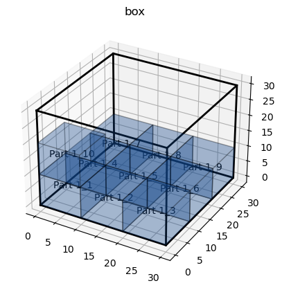
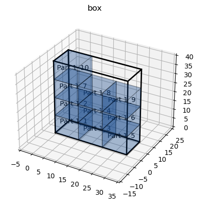

3D Bin Packing
====

3D Bin Packing improvements based on [this repository](https://github.com/enzoruiz/3dbinpacking).

三维装箱针对原有方法进行改进，原始方法不在赘述，主要改进如下：

1、对项目进行整理，通过Solution 函数可以直接进行装箱，不需要考虑底层算法，直接进行装箱，可以通过参数进行控制，绘图等。

2、新增未知箱子大小，即商品装入箱子的问题，但包材大小无法确定，为此提出一种新的解决方法方便寻找合适的箱子大小，此时可以调用solution find_box方法查看装箱箱子大小，也可以通过枚举，暴力搜等方法。

3、针对每个函数的功能进行详细描述，方便使用。

如：
```python
    def find_box(
        self,
        max_width: float = float("inf"),
        max_height: float = float("inf"),
        max_depth: float = float("inf"),
        painting: bool = False,
        number_of_decimals=DEFAULT_NUMBER_OF_DECIMALS,
    ) -> dict:
        """
        max_width: 箱子最大宽度
        max_height: 箱子最大高度
        max_depth: 箱子最大深度
        painting: 是否画图
        """
```

```python
    def pack_verify(
        self,
        bins: [Bin],
        items: List[ItemSet] = None,
        bigger_first=True,
        distribute_items=True,
        fix_point=True,
        check_stable=True,
        support_surface_ratio=0,
        binding: list = [],
        painting: bool = False,
    ):
        """
        :param  bins: 盒子大小
                bigger_first: 放置
                distribute_items=True，按顺序将物品放入箱子中，如果箱子已满，则剩余物品将继续装入下一个箱子，直到所有箱子装满或所有物品都被打包。 distribute_items=False，比较所有箱子的打包情况，即每个箱子打包所有物品，而不是剩余物品。
                fix_point 重力问题
                check_stable 稳定性
                support_surface_ratio 可支撑的面积大小
                binding： binding = [(orange,apple),(computer,hat,watch)]用来组合打包
        """
```

4、 find box 确保箱子形状为 最长边尽量的小，如果需要修改，接近正方体或其他形状，可以修改Bin 类中的 putItemV2 方法。
```python
                volume = width * height * depth
                tmp_side = max(width, height, depth)
                # 判断是否小于最小体积 长边不超过最大边长
                if volume < min_volume and tmp_side <= max_side:
                    # 更新最大值
                    max_side = tmp_side
                    min_volume = volume
                    rotation_type = rotation_idx
                    min_x, min_y, min_z = x, y, z
                    min_width, min_height, min_depth = width, height, depth
                    fit = True
```
本次修改提供 utils 方法，可以控制箱子形状
```python
def calculate_standard_deviation(dimensions):
    width, height, depth = dimensions
    ratios = [depth / width, width / height, height / depth]
    min_diff = abs(min(ratios) - 1)
    max_diff = abs(max(ratios) - 1)

    # 计算差值，越接近1表示越接近正方体
    diff = 1 - (max_diff + min_diff) / 2

    return diff
```

使用过PSO和GA对算法进行改进，但是效果不佳

## 详细使用方法：
```python
from py3dbp import Solution
from py3dbp.spec import ItemSet
```


```python
from py3dbp.spec import Bin
# 设置物品或盒子大小
item_sets = [ItemSet(partno="Part 1",name='Part 1', quantity=10, width=10, height=10, depth=10, weight=10)]
solution = Solution(item_sets)
```


```python
# 设置盒子尺寸和最大重量
box = Bin(partno="box",WHD=(30,30,30),max_weight=1000)
# 模拟打包
solution.pack_verify(bins=[box],painting=True)
```


    

    


    {'box': {'unfitted_items': {},
      'fitted_items': {'Part 1_1': {'name': 'Part 1',
        'position': [Decimal('0'), Decimal('0'), Decimal('0')],
        'width': Decimal('10.00'),
        'height': Decimal('10.00'),
        'depth': Decimal('10.00'),
        'weight': Decimal('10.00')},
       'Part 1_4': {'name': 'Part 1',
        'position': [Decimal('0'), Decimal('10'), Decimal('0')],
        'width': Decimal('10.00'),
        'height': Decimal('10.00'),
        'depth': Decimal('10.00'),
        'weight': Decimal('10.00')},
       'Part 1_7': {'name': 'Part 1',
        'position': [Decimal('0'), Decimal('20'), Decimal('0')],
        'width': Decimal('10.00'),
        'height': Decimal('10.00'),
        'depth': Decimal('10.00'),
        'weight': Decimal('10.00')},
       'Part 1_10': {'name': 'Part 1',
        'position': [Decimal('0'), Decimal('0'), Decimal('10')],
        'width': Decimal('10.00'),
        'height': Decimal('10.00'),
        'depth': Decimal('10.00'),
        'weight': Decimal('10.00')},
       'Part 1_2': {'name': 'Part 1',
        'position': [Decimal('10'), Decimal('0'), Decimal('0')],
        'width': Decimal('10.00'),
        'height': Decimal('10.00'),
        'depth': Decimal('10.00'),
        'weight': Decimal('10.00')},
       'Part 1_5': {'name': 'Part 1',
        'position': [Decimal('10'), Decimal('10'), Decimal('0')],
        'width': Decimal('10.00'),
        'height': Decimal('10.00'),
        'depth': Decimal('10.00'),
        'weight': Decimal('10.00')},
       'Part 1_8': {'name': 'Part 1',
        'position': [Decimal('10'), Decimal('20'), Decimal('0')],
        'width': Decimal('10.00'),
        'height': Decimal('10.00'),
        'depth': Decimal('10.00'),
        'weight': Decimal('10.00')},
       'Part 1_3': {'name': 'Part 1',
        'position': [Decimal('20'), Decimal('0'), Decimal('0')],
        'width': Decimal('10.00'),
        'height': Decimal('10.00'),
        'depth': Decimal('10.00'),
        'weight': Decimal('10.00')},
       'Part 1_6': {'name': 'Part 1',
        'position': [Decimal('20'), Decimal('10'), Decimal('0')],
        'width': Decimal('10.00'),
        'height': Decimal('10.00'),
        'depth': Decimal('10.00'),
        'weight': Decimal('10.00')},
       'Part 1_9': {'name': 'Part 1',
        'position': [Decimal('20'), Decimal('20'), Decimal('0')],
        'width': Decimal('10.00'),
        'height': Decimal('10.00'),
        'depth': Decimal('10.00'),
        'weight': Decimal('10.00')}},
      'width': Decimal('30.00'),
      'height': Decimal('30.00'),
      'depth': Decimal('30.00'),
      'weight': Decimal('1000.00'),
      'resolve': True}}


```python
# 未知盒子求解决
solution.find_box(painting=True)
```


    

    


    {'status': True, 'box': <py3dbp.spec.bin.Bin at 0x187bef12110>}


```python
# 暴力求解
solution.find_box_by_enum()
# 最小边长暴力求解
solution.find_box_by_min_side()
# 因式分解求解
solution.find_box_by_factorization()
```


    (Decimal('25.00'), Decimal('25.00'), Decimal('16.00'))


```python

```


以下为原始example，供参考。

## OutLine
- [3D Bin Packing](#3d-bin-packing)
  - [OutLine](#outline)
  - [Improvement](#improvement)
  - [How to use](#how-to-use)
  - [Example](#example)
      - [Simple example](#simple-example)
      - [example0](#example0)
      - [example1](#example1)
      - [example2](#example2)
      - [example3](#example3)
      - [example4](#example4)
      - [example5](#example5)
      - [example6](#example6)
      - [example7](#example7)
  - [Issue](#issue)
  - [Bug](#bug)
  - [History](#history)
  - [Reference](#reference)
  - [License](#license)


## Improvement
1. **fix item float :**
    * `[fix_point = False/True] type bool` The original packaging method did not consider the gravity problem. After the packaging was completed, there were items floating in the air, which greatly reduced the space utilization of the box. I solved this problem and improved the boxing rate.

    Original packaging  |  Used fix point
    :-------------------------:|:-------------------------:
      |  

2. **Item bearing problem :**
    * `[loadbear = X] type int` The original method did not consider the problem of project load-bearing, because load-bearing involves the structure, I used the priority to sort the projects with higher load-bearing capacity.The higher the number, the higher the priority.

3. **Item need to pack :**
    * `[level = X] type int` The priority can be set to sort which items should be packaged first, to ensure that these items will be packaged in bin.The lower the number, the higher the priority.

4. **Items can be placed upside down or not :**
    * `[updown = False/True] type bool` True means the item can be placed upside down.

5. **Make a set of items :** 
    * `[binding = [(orange,apple),(computer,hat,watch)]] type tuple in list` The number of items in the set must be the same in the bin.
    * eg. `binding = [(orange,apple),(computer,hat,watch)]`.

6. **Container coner :**
    * `[corner = X] type int` Set the size of container corner, the unit is cm, color is black.

    

7. **Paint picture :** 
    * `[painter.plotBoxAndItems()]` Draw pictures.

8. **Calculate gravity distribution :**
    * `print("gravity distribution : ",bin.gravity) ` Divide the bin into four equal parts, and calculate the weight ratio of the equal parts. Ideally, the weight ratio of each equal part tends to be close.

9. **Add the order of placing items :**
    * `put_type = 0 or 1 (0 : general & 1 : open top)` Added the order of placing items. There are two placement methods. Set the bin to open top or general, and the returned results are sorted according to this method.

10. **Mixed cube and cylinder :** 
    * `typeof = cube or cylinder`  mixed with cube and cylinder .

    

11. **Check stability on item :**
    * If you want to use this function,`fix_point = True` and `check_stable=True` and `0 < support_surface_ratio <= 1 `.
    * Rule :
      1. Define a support ratio(support_surface_ratio), if the ratio below the support surface does not exceed this ratio, compare the next rule.
      2. If there is no support under any of the bottom four vertices of the item, then remove the item.

    ! check stable  |  check stable
    :-------------------------:|:-------------------------:
      |  

12. **distribute items :**
    * If you have multiple boxes, you can change distribute_items to achieve different packaging purposes.
    * Rule :
      1. distribute_items=True , put the items into the box in order, if the box is full, the remaining items will continue to be loaded into the next box until all the boxes are full or all the items are packed.
      2. distribute_items=False, compare the packaging of all boxes, that is to say, each box packs all items, not the remaining items.
    
    img |  distribute_items | ! distribute_items
    :-------------------------:|:-------------------------:|:-------------------------:
    Bin1 |   |   
    Bin2 |   |   

13. **Write part number on item :**
    * Check **Painting** in [how to use](#how-to-use).
    * In order to better distinguish each item, I write part no in the middle of the item, but if I do this, it will be blocked by the color, so it is best to set the alpha value to about 0.2.

    

## How to use

**Init bin :** 
```python
box1 = Bin(
    partno='Bin',         # partno / PN of item (unique value)
    WHD=(589,243,259),    # (width , height , depth)
    max_weight=28080,     # box can bear the weight
    corner=15             # container coner
    put_type= 1           # add the order of placing items
)
```

**Init item :** 
```python
item1 = Item(
    partno='testItem', # partno / PN of item (unique value)
    name='wash',       # type of item
    typeof='cube',     # cube or cylinder
    WHD=(85, 60, 60),  # (width , height , depth)
    weight=10,         # item weight
    level=1,           # priority (Item need to pack)
    loadbear=100,      # item bearing
    updown=True,       # item fall down or not
    color='#FFFF37'    # set item color , you also can use color='red' or color='r'
)
```

**Init packer :**
```python
packer = Packer()          # packer init
```

**Add bin and items to packer : ~~(Warning : You can only add one bin,but you can add many items.)~~ Now you can add multiple bins/boxes,plz check example7.**
```python
packer.addBin(box1)       # adding bins to packer
packer.addItem(item1)     # adding items to packer
```

**Start pack items :** 
```python
packer.pack(
    bigger_first=True,                 # bigger item first.
    fix_point=True,                    # fix item float problem.
    binding=[('server','cabint')],     # make a set of items.
    distribute_items=True,             # If multiple bin, to distribute or not.
    check_stable=True,                 # check stability on item.
    support_surface_ratio=0.75,        # set support surface ratio.
    number_of_decimals=0
)
```

**Results :**
```python
packer.bins              # get bin of packer
packer.bin[i].items      # get fitted items in bin
packer.unfit_items       # get unfitted items 
```

**Painting :**
```python
for b in packer :
    painter = Painter(b)
    fig = painter.plotBoxAndItems(
        title=b.partno,
        alpha=0.2,         # set item alpha
        write_num=True,    # open/close write part number 
        fontsize=10        # control write_num fontsize
    )
fig.show() 
```

## Example

#### Simple example
```python
from py3dbp import Packer, Bin, Item
import time

start = time.time()

# init packing function
packer = Packer()

#  init bin
box = Bin('example',(30, 10, 15), 99,0)
packer.addBin(box)

#  add item
packer.addItem(Item('test1', 'test','cube',(9, 8, 7), 1, 1, 100, True,'red'))
packer.addItem(Item('test2', 'test','cube',(4, 25, 1), 1, 1, 100, True,'blue'))
packer.addItem(Item('test3', 'test','cube',(2, 13, 5), 1, 1, 100, True,'gray'))
packer.addItem(Item('test4', 'test','cube',(7, 5, 4), 1, 1, 100, True,'orange'))
packer.addItem(Item('test5', 'test','cube',(10, 5, 2), 1, 1, 100, True,'lawngreen'))

# calculate packing 
packer.pack(
    bigger_first=True,
    fix_point=True,
    distribute_items=True,
    check_stable=True,
    support_surface_ratio=0.75,
    number_of_decimals=0
)

# paint the results
for b in packer :
    painter = Painter(b)
    fig = painter.plotBoxAndItems(
        title=b.partno,
        alpha=0.2,         
        write_num=True,   
        fontsize=10        
    )
fig.show()
```
#### example0
* This example can be used to compare the `fix_point` function with and without the `fix_point` function.

#### example1
* This example is used to demonstrate the mixed packing of cube and cylinder.

#### example2
* This case is used to demonstrate an example of a packing complex situation.

#### example3
* This example is used to demonstrate that the algorithm does not optimize.

#### example4
* This example can be used to test large batch calculation time and binding functions.

#### example5
* Check stability on item - first rule
* Define a support ratio, if the ratio below the support surface does not exceed this ratio, compare the second rule.

#### example6
* Check stability on item - second rule
* If there is no support under any of the bottom four vertices of the item, then remove the item.

#### example7
* If you have multiple boxes, you can change `distribute_items` to achieve different packaging purposes.
* `distribute_items=True` , put the items into the box in order, if the box is full, the remaining items will continue to be loaded into the next box until all the boxes are full  or all the items are packed.
* `distribute_items=False`, compare the packaging of all boxes, that is to say, each box packs all items, not the remaining items.

## Reference

* [Optimizing three-dimensional bin packing through simulation](https://github.com/jerry800416/3dbinpacking/blob/master/reference/OPTIMIZING%20THREE-DIMENSIONAL%20BIN%20PACKING%20THROUGH%20SIMULATION.pdf)
* https://github.com/enzoruiz/3dbinpacking
* https://github.com/nmingotti/3dbinpacking


## License

[MIT](https://github.com/npc01robot/3dbinbox/blob/main/LICENSE)
